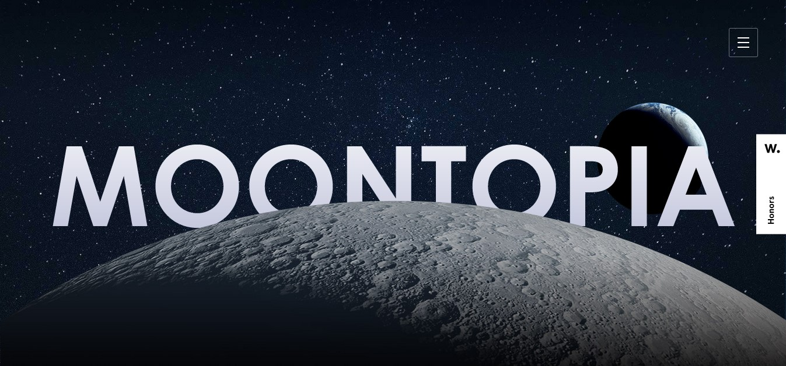

# Website Replica - Project 1 
The objective of this project is to replicate a website with the purpose of applying basic concepts of the use of React, ESlint, Babel, Webpack and CSS/SASS, replicating the elements, animations and styles of the original website.

### Author:
- Jennifer Sandoval [@JennsiS](https://github.com/JennsiS)

# Website Reference
#### Moontopia 
[Moontopia original website :link:](https://www.hillarys.co.uk/static/moontopia/)

# How to use? :arrow_right:

1. Download bundle folder 
2. Open index.html file in a web browser

**OR**

Visit the next link:
    [moontopia replica :link:]() 

:warning:(this link will be active for a limited time):warning:

# Tools :wrench:
* Sass (v^1.50.1)
* AOS animation
* Webpack (v^5.72.0)
* Babel
* Eslint (v^8.13.0)
* Node.js (v16.14.2)
* Nginx
* Prettier (v^2.6.2)

> For more information about dependencies look at [package.json](/package.json)

# Disclaimer :bangbang:
This project was made for educational purposes. 

# References

- [Original Website](https://www.hillarys.co.uk/static/moontopia/)
- [Float Animation](https://codepen.io/MarioDesigns/pen/woJgeo)
- [Zoom Animation](https://www.w3schools.com/howto/howto_css_zoom_hover.asp)
- [Webpack](https://webpack.js.org/)
- [ESlint](https://eslint.org/)
- [Sass](https://sass-lang.com/)
- [Babel](https://babeljs.io/)
- [React](https://es.reactjs.org/)
